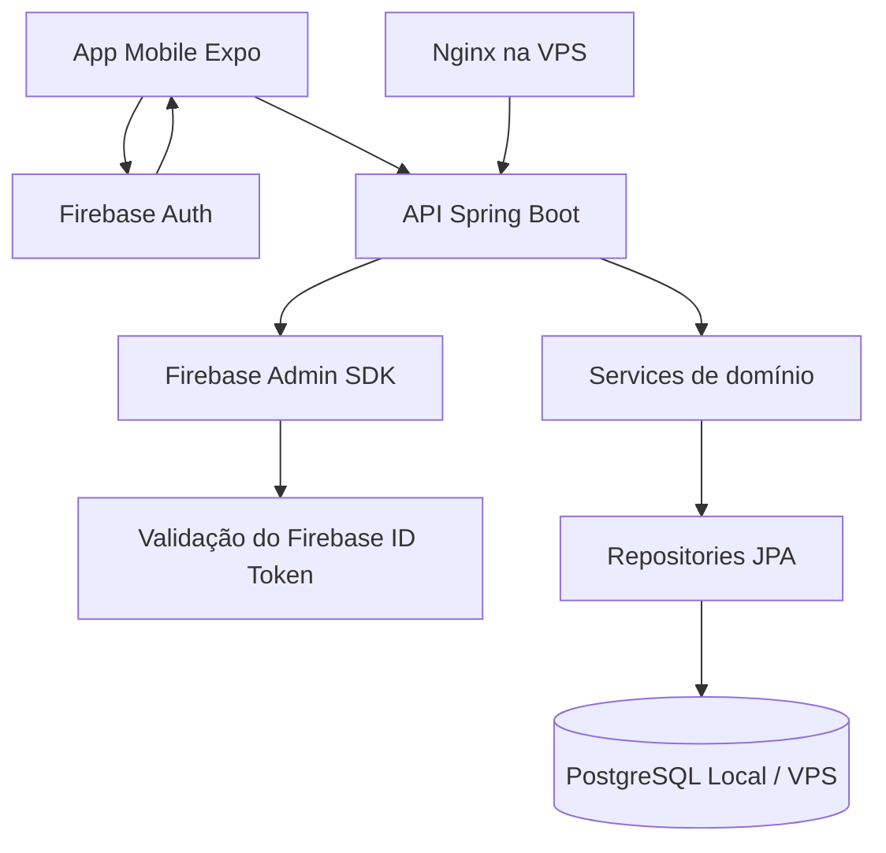
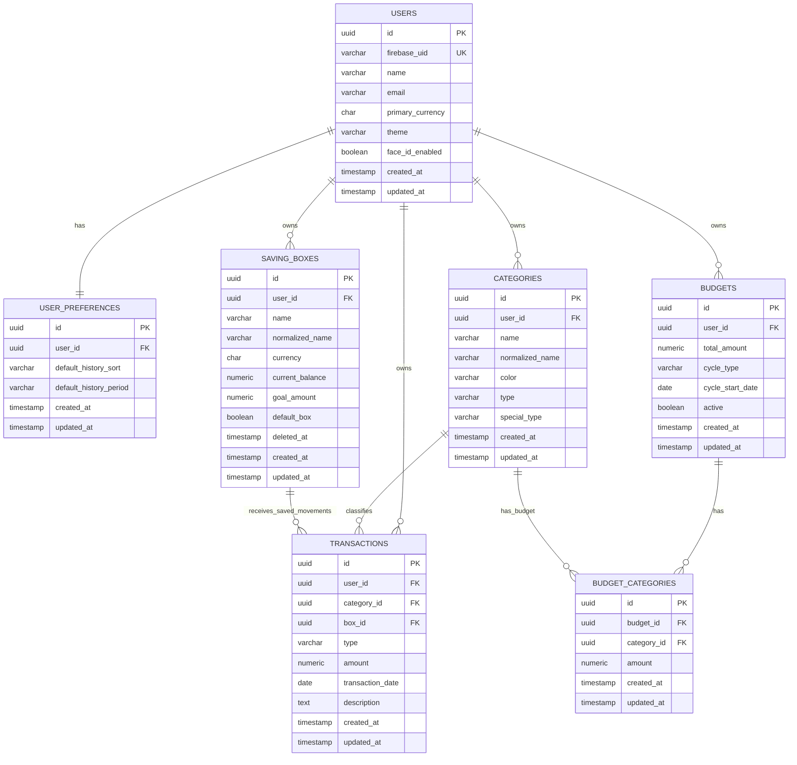

# PRD Backend — FinBox

## 1. Visão geral

O backend do **FinBox** será uma API REST em **Java com Spring Boot**, responsável por todas as regras financeiras do app.

A autenticação será feita com **Firebase Auth**, enquanto os dados financeiros ficarão em um **PostgreSQL próprio**.

Durante o alpha, o ambiente será local. Após o alpha, a API e o banco serão migrados para uma VPS.

---

## 2. Objetivo do backend

O backend deve permitir:

- validar usuários autenticados via Firebase Auth;
- isolar dados por usuário;
- gerenciar perfil e preferências;
- gerenciar categorias;
- gerenciar receitas e despesas;
- gerenciar budget total e por categoria;
- calcular ciclos de budget;
- gerenciar caixas de dinheiro guardado em BRL;
- gerar dashboard básico.

---

## 3. Escopo do backend no MVP

### Entra no MVP

- Autenticação via Firebase ID Token.
- Criação automática de perfil interno no primeiro acesso.
- Criação automática das categorias especiais:
  - Não categorizado;
  - Guardado.
- CRUD de categorias.
- CRUD de transações.
- Histórico com filtros e paginação.
- Budget total.
- Budget por categoria.
- Ciclo de budget:
  - semanal;
  - quinzenal;
  - mensal.
- Alertas de budget.
- Caixas de dinheiro guardado em BRL.
- Caixa padrão “Economias” em BRL.
- Metas simples de caixas.
- Dashboard básico.

### Fora do MVP

- Cartão de crédito.
- Parcelamento.
- Forma de pagamento.
- Contas bancárias.
- Integração bancária.
- Importação de extrato.
- Exportação PDF.
- Conversão automática entre moedas.
- Multi-moeda nas caixas.
- Ciclo de budget personalizado.
- Snapshots técnicos de ciclos fechados.
- Relatórios principais.
- Transferências entre caixas.
- Sincronização básica de transações offline.
- Preferências avançadas de dashboard.
- Notificações.
- Anexos/comprovantes.

---

## 4. Arquitetura geral

### Tipo de arquitetura

A arquitetura recomendada é:

- monólito modular;
- API REST;
- Spring Boot;
- PostgreSQL;
- Firebase Auth para autenticação;
- Firebase Admin SDK no backend para validação de token;
- regras de negócio centralizadas em services;
- migrations com Flyway;
- deploy futuro em VPS com Docker Compose.

---

## 5. Diagrama de arquitetura



---

## 6. Fluxo de autenticação

### Login no app

1. O app mobile faz login usando Firebase Auth.
2. Firebase retorna um ID Token.
3. O app envia esse token no header das chamadas para a API.
4. A API valida o token usando Firebase Admin SDK.
5. A API extrai o `firebase_uid`.
6. A API busca ou cria o usuário interno no banco.
7. Todas as operações usam o usuário interno autenticado.

### Header padrão

```http
Authorization: Bearer <firebase_id_token>
```

---

## 7. Responsabilidades por serviço

### Firebase Auth

Responsável por:

- cadastro com e-mail/senha;
- login com e-mail/senha;
- login com Google;
- gerenciamento da sessão no app;
- emissão do ID Token.

### Backend Spring Boot

Responsável por:

- validar ID Token;
- criar perfil interno do usuário;
- controlar regras financeiras;
- garantir isolamento de dados;
- salvar dados no PostgreSQL;
- gerar dashboard básico.

### PostgreSQL

Responsável por armazenar:

- usuários internos;
- preferências;
- categorias;
- transações;
- budgets;
- caixas;
- dashboards básicos.

---

## 8. Ambientes

### Ambiente local / alpha

Durante o alpha:

- API Spring Boot local;
- PostgreSQL local via Docker;
- Firebase Auth em projeto de desenvolvimento;
- Flyway para migrations;
- testes com JUnit e Testcontainers.

### Ambiente VPS / pós-alpha

Após o alpha:

- API Spring Boot em container Docker;
- PostgreSQL na VPS;
- Nginx como reverse proxy;
- SSL com Let's Encrypt;
- backups automáticos do banco;
- logs persistentes;
- variáveis de ambiente para segredos.

---

## 9. Stack backend

- Java 21.
- Spring Boot.
- Spring Web.
- Spring Security.
- Spring Data JPA.
- PostgreSQL.
- Flyway.
- Bean Validation.
- Firebase Admin SDK.
- JUnit.
- Mockito.
- Testcontainers.
- Docker.
- Docker Compose.

---

## 10. Regras gerais de segurança

Toda tabela principal deve ter `user_id`.

Toda operação deve validar:

```text
recurso.user_id == usuário autenticado
```

Nunca buscar recurso apenas pelo ID.

Errado:

```java
transactionRepository.findById(id)
```

Certo:

```java
transactionRepository.findByIdAndUserId(id, userId)
```

---

## 11. Regra de bootstrap do usuário

No primeiro acesso autenticado, o backend deve criar automaticamente:

- registro em `users`;
- registro em `user_preferences`;
- categoria “Não categorizado”;
- categoria “Guardado”.

O backend deve identificar o usuário pelo `firebase_uid` recebido no token.

---

## 12. Diagrama relacional do banco



---

## 13. Tabelas

## 13.1. users

Representa o usuário dentro do sistema financeiro.

O usuário real é autenticado pelo Firebase, mas o backend mantém um perfil interno.

### Campos

```text
id UUID PK
firebase_uid VARCHAR(128) UNIQUE NOT NULL
name VARCHAR(120) NOT NULL
email VARCHAR(180) NOT NULL
primary_currency CHAR(3) DEFAULT 'BRL'
theme VARCHAR(20) DEFAULT 'SYSTEM'
face_id_enabled BOOLEAN DEFAULT false
created_at TIMESTAMP NOT NULL
updated_at TIMESTAMP NOT NULL
```

### Regras

- `firebase_uid` vem do token do Firebase.
- `email` vem do token do Firebase.
- `primary_currency` inicial é BRL.
- `theme` inicial é SYSTEM.
- O usuário é criado automaticamente no primeiro acesso.

---

## 13.2. user_preferences

Preferências básicas do usuário.

### Campos

```text
id UUID PK
user_id UUID FK NOT NULL
default_history_sort VARCHAR(40) DEFAULT 'NEWEST_FIRST'
default_history_period VARCHAR(40) DEFAULT 'CURRENT_MONTH'
created_at TIMESTAMP NOT NULL
updated_at TIMESTAMP NOT NULL
```

### Regras

- Cada usuário tem um registro de preferências.
- Criado automaticamente junto com `users`.

---

## 13.3. categories

Categorias do usuário.

### Campos

```text
id UUID PK
user_id UUID FK NOT NULL
name VARCHAR(80) NOT NULL
normalized_name VARCHAR(80) NOT NULL
color VARCHAR(20) NOT NULL
type VARCHAR(20) NOT NULL
special_type VARCHAR(30) DEFAULT 'CUSTOM'
created_at TIMESTAMP NOT NULL
updated_at TIMESTAMP NOT NULL
```

### type

```text
INCOME
EXPENSE
BOTH
```

### special_type

```text
CUSTOM
UNCATEGORIZED
SAVED
```

### Regras

- Não haverá categorias padrão comuns.
- Usuário cria suas próprias categorias.
- Nome não pode repetir para o mesmo usuário.
- Comparação ignora maiúsculas/minúsculas.
- `normalized_name` deve guardar o nome normalizado.
- Categorias especiais não podem ser deletadas.
- Categorias especiais não podem ser renomeadas.

### Categorias especiais

#### Não categorizado

```text
name = "Não categorizado"
color = "LIGHT_GRAY"
type = BOTH
special_type = UNCATEGORIZED
```

#### Guardado

```text
name = "Guardado"
color = "DARK_GRAY"
type = BOTH
special_type = SAVED
```

### Constraint

```sql
CREATE UNIQUE INDEX uk_category_name_per_user
ON categories(user_id, normalized_name);
```

---

## 13.4. transactions

Receitas e despesas.

### Campos

```text
id UUID PK
user_id UUID FK NOT NULL
category_id UUID FK NOT NULL
box_id UUID FK NULL
type VARCHAR(20) NOT NULL
amount NUMERIC(19,2) NOT NULL
transaction_date DATE NOT NULL
description TEXT NULL
created_at TIMESTAMP NOT NULL
updated_at TIMESTAMP NOT NULL
```

### type

```text
INCOME
EXPENSE
```

### Regras

- Valor mínimo: 0.01.
- Valor não pode ser negativo.
- Descrição é opcional.
- Data é obrigatória.
- Se categoria não for informada, usar “Não categorizado”.
- Se categoria for “Guardado”, `box_id` é obrigatório.
- Se categoria não for “Guardado”, `box_id` deve ser nulo.
- Receita em “Guardado” aumenta saldo da caixa.
- Despesa em “Guardado” diminui saldo da caixa.
- Despesa em “Guardado” não pode deixar caixa negativa.

---

## 13.5. budgets

Budget ativo do usuário.

### Campos

```text
id UUID PK
user_id UUID FK NOT NULL
total_amount NUMERIC(19,2) NOT NULL
cycle_type VARCHAR(20) NOT NULL
cycle_start_date DATE NOT NULL
active BOOLEAN DEFAULT true
created_at TIMESTAMP NOT NULL
updated_at TIMESTAMP NOT NULL
```

### cycle_type

```text
WEEKLY
BIWEEKLY
MONTHLY
```

### Regras

- Cada usuário pode ter apenas um budget ativo.
- Budget considera apenas despesas.
- Receitas não afetam o budget.
- Alteração vale para ciclo atual e ciclos futuros.
- Ciclos anteriores não são preservados por snapshot no MVP.

### Constraint

```sql
CREATE UNIQUE INDEX uk_active_budget_per_user
ON budgets(user_id)
WHERE active = true;
```

---

## 13.6. budget_categories

Budget por categoria.

### Campos

```text
id UUID PK
budget_id UUID FK NOT NULL
category_id UUID FK NOT NULL
amount NUMERIC(19,2) NOT NULL
created_at TIMESTAMP NOT NULL
updated_at TIMESTAMP NOT NULL
```

### Regras

- Soma dos budgets por categoria não pode passar do budget total.
- Categoria sem budget próprio reduz apenas o budget total.
- Categoria “Guardado” pode ter budget próprio.

### Constraint

```sql
CREATE UNIQUE INDEX uk_budget_category
ON budget_categories(budget_id, category_id);
```

---

## 13.7. budget_cycle_snapshots

Fora do MVP. Será avaliado quando relatórios históricos entrarem.

---

## 13.8. saving_boxes

Caixas de dinheiro guardado.

### Campos

```text
id UUID PK
user_id UUID FK NOT NULL
name VARCHAR(80) NOT NULL
normalized_name VARCHAR(80) NOT NULL
currency CHAR(3) NOT NULL
current_balance NUMERIC(19,2) DEFAULT 0
goal_amount NUMERIC(19,2) NULL
default_box BOOLEAN DEFAULT false
deleted_at TIMESTAMP NULL
created_at TIMESTAMP NOT NULL
updated_at TIMESTAMP NOT NULL
```

### Regras

- Usuário pode ter várias caixas.
- No MVP, todas as caixas usam BRL.
- Não pode ter duas caixas com mesmo nome.
- Comparação ignora maiúsculas/minúsculas.
- Moeda não pode ser alterada depois da criação.
- Caixa não pode ficar negativa.
- Caixa “Economias” não pode ser deletada.
- Caixa “Economias” não pode ser renomeada.
- Caixa “Economias” não pode ter meta.

### Exclusão

Usar exclusão lógica com `deleted_at`.

Motivo:

- preserva histórico;
- evita quebrar transações antigas;
- mantém histórico consistente.

### Constraints

```sql
CREATE UNIQUE INDEX uk_active_box_name_per_user
ON saving_boxes(user_id, normalized_name)
WHERE deleted_at IS NULL;
```

```sql
CREATE UNIQUE INDEX uk_default_box_per_user
ON saving_boxes(user_id)
WHERE default_box = true AND deleted_at IS NULL;
```

---

## 13.9. box_transfers

Fora do MVP. Movimentações entre caixas serão adicionadas depois da validação do fluxo básico de caixas.

---

## 14. Arquitetura sugerida do projeto Spring Boot

```text
src/main/java/com/finbox/api
│
├── FinboxApplication.java
│
├── config
│   ├── SecurityConfig.java
│   ├── FirebaseConfig.java
│   ├── JpaConfig.java
│   ├── JacksonConfig.java
│   └── OpenApiConfig.java
│
├── security
│   ├── FirebaseAuthenticationFilter.java
│   ├── FirebaseTokenService.java
│   ├── AuthenticatedUser.java
│   └── CurrentUserProvider.java
│
├── common
│   ├── exception
│   │   ├── ApiExceptionHandler.java
│   │   ├── NotFoundException.java
│   │   ├── ForbiddenException.java
│   │   ├── BusinessRuleException.java
│   │   └── ValidationException.java
│   │
│   ├── response
│   │   ├── ApiErrorResponse.java
│   │   └── PageResponse.java
│   │
│   ├── util
│   │   ├── MoneyUtils.java
│   │   ├── TextNormalizer.java
│   │   └── DateUtils.java
│   │
│   └── enums
│       ├── TransactionType.java
│       ├── CategoryType.java
│       ├── CategorySpecialType.java
│       ├── BudgetCycleType.java
│       ├── BudgetStatus.java
│       ├── ThemePreference.java
│       └── HistorySortType.java
│
├── user
│   ├── controller
│   │   └── UserController.java
│   ├── service
│   │   ├── UserService.java
│   │   └── UserBootstrapService.java
│   ├── repository
│   │   ├── UserRepository.java
│   │   └── UserPreferenceRepository.java
│   ├── entity
│   │   ├── User.java
│   │   └── UserPreference.java
│   └── dto
│       ├── UserResponse.java
│       ├── UpdateUserRequest.java
│       └── UpdatePreferencesRequest.java
│
├── category
│   ├── controller
│   │   └── CategoryController.java
│   ├── service
│   │   └── CategoryService.java
│   ├── repository
│   │   └── CategoryRepository.java
│   ├── entity
│   │   └── Category.java
│   └── dto
│       ├── CategoryResponse.java
│       ├── CreateCategoryRequest.java
│       └── UpdateCategoryRequest.java
│
├── transaction
│   ├── controller
│   │   └── TransactionController.java
│   ├── service
│   │   └── TransactionService.java
│   ├── repository
│   │   └── TransactionRepository.java
│   ├── entity
│   │   └── Transaction.java
│   └── dto
│       ├── TransactionResponse.java
│       ├── CreateTransactionRequest.java
│       ├── UpdateTransactionRequest.java
│       └── TransactionFilterRequest.java
│
├── budget
│   ├── controller
│   │   └── BudgetController.java
│   ├── service
│   │   ├── BudgetService.java
│   │   └── BudgetCycleService.java
│   ├── repository
│   │   ├── BudgetRepository.java
│   │   └── BudgetCategoryRepository.java
│   ├── entity
│   │   ├── Budget.java
│   │   └── BudgetCategory.java
│   └── dto
│       ├── BudgetResponse.java
│       ├── CreateBudgetRequest.java
│       ├── UpdateBudgetRequest.java
│       └── BudgetUsageResponse.java
│
├── savingbox
│   ├── controller
│   │   └── SavingBoxController.java
│   ├── service
│   │   └── SavingBoxService.java
│   ├── repository
│   │   └── SavingBoxRepository.java
│   ├── entity
│   │   └── SavingBox.java
│   └── dto
│       ├── SavingBoxResponse.java
│       ├── CreateSavingBoxRequest.java
│       ├── UpdateSavingBoxRequest.java
│       └── SavingBoxMovementResponse.java
│
└── dashboard
│   ├── controller
│   │   └── DashboardController.java
│   ├── service
│   │   └── DashboardService.java
│   └── dto
│       └── DashboardResponse.java
│
```

---

## 15. Camadas do backend

### Controller

Responsável por:

- receber requisição;
- validar DTO;
- chamar service;
- devolver response.

Não deve conter regra de negócio.

### Service

Responsável por:

- regras de negócio;
- validações complexas;
- isolamento por usuário;
- transações de banco;
- cálculos;
- orquestração entre entidades.

### Repository

Responsável por:

- acesso ao banco;
- queries filtradas por `user_id`;
- paginação;
- consultas agregadas para dashboard.

### Entity

Representa tabelas do banco.

Não deve carregar regra complexa.

### DTO

Separar:

- requests;
- responses;
- filtros;
- dashboard.

---

## 16. Endpoints principais

## Usuário

```text
GET    /me
PATCH  /me
DELETE /me
PATCH  /me/preferences
```

## Categorias

```text
GET    /categories
POST   /categories
PATCH  /categories/{id}
DELETE /categories/{id}
```

## Transações

```text
GET    /transactions
POST   /transactions
GET    /transactions/{id}
PATCH  /transactions/{id}
DELETE /transactions/{id}
```

## Budget

```text
GET    /budget
POST   /budget
PATCH  /budget
GET    /budget/current-cycle
```

## Caixas

```text
GET    /boxes
POST   /boxes
GET    /boxes/{id}
PATCH  /boxes/{id}
DELETE /boxes/{id}
GET    /boxes/{id}/movements
```

## Dashboard

```text
GET /dashboard
```

---

## 17. Serviços principais

## FirebaseTokenService

Responsável por:

- receber ID Token;
- validar com Firebase Admin SDK;
- extrair `firebase_uid`, e-mail e nome.

## UserBootstrapService

Responsável por garantir que todo usuário autenticado tenha:

- usuário interno;
- preferências;
- categoria “Não categorizado”;
- categoria “Guardado”.

## CategoryService

Responsável por:

- criar categoria;
- editar categoria;
- deletar categoria;
- mover transações para categoria destino;
- impedir alteração/deleção de categorias especiais.

## TransactionService

Responsável por:

- criar receita/despesa;
- editar transação;
- excluir transação;
- aplicar regra de categoria “Guardado”;
- atualizar saldo de caixa;
- impedir caixa negativa.

## BudgetService

Responsável por:

- criar budget;
- editar budget;
- validar soma por categoria;
- calcular uso atual;
- retornar status normal/luz amarela/vermelho.

## BudgetCycleService

Responsável por:

- calcular ciclo atual;
- calcular início e fim do ciclo;
- calcular início e fim do ciclo.

## SavingBoxService

Responsável por:

- criar caixa;
- criar “Economias” em BRL;
- editar nome;
- excluir caixa;
- impedir saldo negativo;
- manter moeda fixa em BRL no MVP.

## DashboardService

Responsável por montar:

- resumo do ciclo;
- barra de budget;
- últimas 5 transações;
- total guardado em BRL.

---

## 18. Regras transacionais importantes

## Criar transação em “Guardado”

Deve rodar dentro de transação de banco.

Fluxo:

```text
1. Validar usuário autenticado.
2. Buscar categoria do usuário.
3. Verificar se categoria é Guardado.
4. Buscar caixa do usuário com lock.
5. Se receita, aumentar saldo da caixa.
6. Se despesa, validar saldo e diminuir saldo da caixa.
7. Salvar transação.
8. Salvar caixa.
```

## 19. Histórico geral

Endpoint:

```text
GET /transactions
```

Filtros:

```text
startDate
endDate
categoryId
type
minAmount
maxAmount
description
sort
page
size
```

Ordenações:

```text
NEWEST_FIRST
OLDEST_FIRST
HIGHEST_AMOUNT
LOWEST_AMOUNT
```

Padrão:

```text
NEWEST_FIRST
```

Paginação padrão:

```text
page = 0
size = 20
```

---

## 20. Tratamento de erros

Formato padrão:

```json
{
  "timestamp": "2026-05-24T21:00:00Z",
  "status": 400,
  "error": "BUSINESS_RULE_ERROR",
  "message": "Valor inválido.",
  "path": "/transactions"
}
```

Tipos de erro:

```text
VALIDATION_ERROR
NOT_FOUND
FORBIDDEN
BUSINESS_RULE_ERROR
UNAUTHORIZED
INTERNAL_ERROR
```

---

## 21. Configuração local com Docker Compose

```yaml
services:
  postgres:
    image: postgres:16
    container_name: finbox-postgres
    environment:
      POSTGRES_DB: finbox
      POSTGRES_USER: finbox
      POSTGRES_PASSWORD: finbox_dev
    ports:
      - "5432:5432"
    volumes:
      - finbox_postgres_data:/var/lib/postgresql/data

volumes:
  finbox_postgres_data:
```

---

## 22. Configuração futura na VPS

```yaml
services:
  api:
    build: .
    container_name: finbox-api
    depends_on:
      - postgres
    environment:
      SPRING_PROFILES_ACTIVE: prod
      DATABASE_URL: jdbc:postgresql://postgres:5432/finbox
      DATABASE_USERNAME: finbox
      DATABASE_PASSWORD: ${DATABASE_PASSWORD}
      FIREBASE_PROJECT_ID: ${FIREBASE_PROJECT_ID}
      FIREBASE_CREDENTIALS_PATH: /run/secrets/firebase-service-account.json
    ports:
      - "8080:8080"

  postgres:
    image: postgres:16
    container_name: finbox-postgres
    environment:
      POSTGRES_DB: finbox
      POSTGRES_USER: finbox
      POSTGRES_PASSWORD: ${DATABASE_PASSWORD}
    volumes:
      - finbox_postgres_data:/var/lib/postgresql/data

volumes:
  finbox_postgres_data:
```

Na VPS, o Nginx deve ficar na frente da API e expor HTTPS.

---

## 23. Prioridade de desenvolvimento backend

## Fase 1 — Base

- Criar projeto Spring Boot.
- Configurar PostgreSQL local.
- Configurar Flyway.
- Configurar Firebase Admin SDK.
- Criar filtro de autenticação Firebase.
- Criar `users`.
- Criar `user_preferences`.
- Criar bootstrap de usuário.

## Fase 2 — Categorias

- Criar tabela `categories`.
- Criar categorias especiais.
- Criar CRUD de categorias.
- Validar nome único.
- Implementar exclusão com categoria destino.

## Fase 3 — Transações

- Criar tabela `transactions`.
- Criar CRUD de transações.
- Criar histórico com filtros.
- Criar paginação.
- Aplicar regra de “Não categorizado”.
- Aplicar regra inicial de “Guardado”.

## Fase 4 — Budget simples

- Criar `budgets`.
- Criar `budget_categories`.
- Calcular ciclo atual semanal, quinzenal e mensal.
- Implementar alertas.

## Fase 5 — Caixas simples

- Criar `saving_boxes`.
- Criar “Economias” em BRL.
- Criar metas.
- Vincular transações “Guardado” com caixas.
- Bloquear saldo negativo.

## Fase 6 — Dashboard básico

- Criar endpoint de dashboard.
- Exibir resumo do ciclo.
- Exibir barra de budget.
- Exibir últimas 5 transações.
- Exibir total guardado.

---

## 24. Critérios técnicos de pronto

Uma funcionalidade backend só está pronta quando:

- tem endpoint implementado;
- valida token Firebase;
- identifica usuário interno;
- filtra por `user_id`;
- tem validação de entrada;
- tem regra de negócio no service;
- tem migration Flyway;
- tem teste unitário dos services principais;
- tem teste de integração para fluxo crítico;
- retorna erros padronizados;
- não permite acesso cruzado entre usuários.

---

## 25. Testes obrigatórios

## Segurança

Testar que:

- usuário A não acessa transação do usuário B;
- usuário A não edita categoria do usuário B;
- usuário A não exclui caixa do usuário B;
- usuário A não acessa budget do usuário B.

## Categorias

Testar que:

- não permite nome duplicado;
- ignora maiúsculas/minúsculas;
- não deleta categorias especiais;
- move transações para “Não categorizado”.

## Transações

Testar que:

- não aceita valor zero;
- não aceita valor negativo;
- sem categoria usa “Não categorizado”;
- “Guardado” exige caixa;
- despesa em “Guardado” não deixa caixa negativa.

## Budget

Testar que:

- soma de categorias não passa do total;
- cálculo de ciclo semanal funciona;
- cálculo de ciclo quinzenal funciona;
- cálculo de ciclo mensal funciona;
- status normal/luz amarela/vermelho funciona.

## Caixas

Testar que:

- cria caixa;
- não cria nome duplicado;
- usa BRL no MVP;
- não altera moeda;
- não deleta “Economias”;
- não permite saldo negativo.

---

## 26. Primeiro marco backend

## Marco 1 — Núcleo financeiro básico

Entregar:

- autenticação com Firebase ID Token;
- criação automática de usuário interno;
- criação automática das categorias especiais;
- CRUD de categorias;
- CRUD de transações;
- histórico paginado;
- isolamento por usuário.

## Marco 2 — MVP financeiro validável

Entregar:

- budget simples;
- caixas simples em BRL;
- transações “Guardado” vinculadas a caixas;
- dashboard básico.

Relatórios, snapshots, transferências, multi-moeda e offline ficam para pós-MVP.
